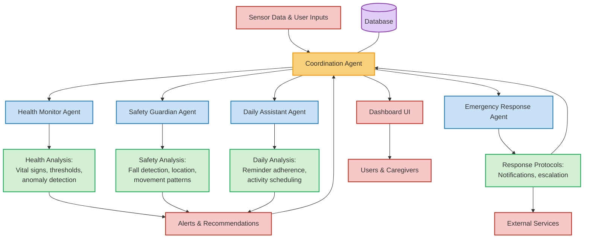

# CareCompanion: Multi-Agent System for Elderly Care

CareCompanion is an AI-powered multi-agent system designed to enhance the quality of elderly care through continuous monitoring, early intervention, and comprehensive support. The system uses specialized agents to monitor health metrics, ensure safety and manage daily activities.

## 🌟 Problem Statement

The aging population faces several challenges:

- Growing elderly demographic with insufficient care resources
- Fragmented monitoring solutions focusing on single aspects of care
- Health issues often detected only after becoming serious
- Heavy emotional and time burdens on family caregivers
- Privacy concerns conflicting with safety needs

## 💡 Solution Overview

CareCompanion addresses these challenges through:

- **Integrated monitoring**: A comprehensive platform with multiple specialized AI agents
- **Personalized care**: Learning individual patterns to detect meaningful anomalies
- **Proactive intervention**: Tiered alerts with appropriate escalation protocols
- **Natural language insights**: LLM-powered analysis in plain language
- **Privacy-preserving design**: Configurable monitoring levels by room and activity

## 🔄 Agents' Interaction Design



## 🏗️ Code Structure

CareCompanion follows a modular, object-oriented architecture with these key components:

```
CareCompanion/
├── app.py                 # Main application entry point
├── agents/                # Agent implementations
│   ├── base_agent.py      # Base agent class with common functionality
│   ├── coordination.py    # Central coordination agent
│   ├── health_monitor.py  # Health monitoring agent
│   ├── safety_guardian.py # Safety and fall detection agent
│   ├── daily_assistant.py # Reminders and daily activities agent
│   └── emergency_response.py # Emergency handling agent
├── utils/                 # Utility services
│   ├── config.py          # Configuration management
│   ├── logger.py          # Logging utilities
│   └── database.py        # Database simulation
├── models/                # Data and LLM models
│   ├── analytics.py       # Data analysis utilities
│   └── llm_client.py      # LLM integration
├── ui/                    # User interface
│   └── dashboard.py       # Streamlit dashboard
├── data/                  # Data sources
│   ├── health_monitoring.csv
│   ├── safety_monitoring.csv
│   └── daily_reminder.csv
├── config.yaml            # System configuration
├── requirements.txt       # Dependencies
└── run.bat                # Startup script
```

All specialized agents inherit from the `BaseAgent` class, which provides common functionality for:
- Asynchronous processing loops
- Message queue handling
- State management
- LLM interaction
- Periodic updates

## 🚀 Features

- **Health Monitoring**: Track vital signs, detect anomalies, generate alerts for health issues
- **Safety Guardian**: Monitor movement patterns, detect falls, ensure user safety
- **Daily Assistant**: Manage medication/hydration reminders, track adherence
- **Emergency Response**: Handle emergencies with tiered protocols (alerts → caregiver notification → emergency services)
- **Coordination**: Central agent managing context across all domains
- **Dashboard**: Comprehensive visualization of user status and alerts

## 🔧 Installation

1. Clone the repository:
```bash
git clone https://github.com/yourusername/carecompanion.git
cd carecompanion
```

2. Install dependencies:
```bash
pip install -r requirements.txt
```

3. Ensure data files are in the correct location:
```
data/
├── health_monitoring.csv
├── safety_monitoring.csv
└── daily_reminder.csv
```

## 🏃‍♂️ Running the Application

### Start the Dashboard

```bash
run.bat dashboard
```

### Start the Backend

```bash
run.bat backend
```

## 🛠️ Technologies Used

- **Python**: Core application language
- **Asyncio**: For concurrent agent operation
- **Pandas/NumPy**: For data analysis
- **Streamlit**: For the dashboard interface
- **Matplotlib/Seaborn**: For data visualization
- **Ollama**: For LLM integration
- **PyYAML**: For configuration management

---

*CareCompanion: Intelligent, coordinated care for aging loved ones.*
